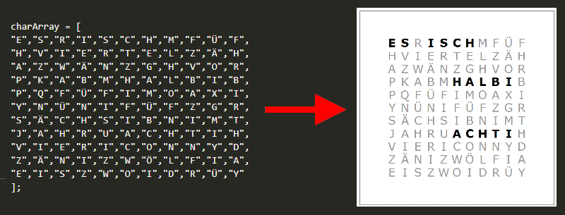

# wordclock-mech
Use this software to convert an array of characters into a frontplate for a wordclock



---

## Tool configuration
The following software versions were used to develop this software:
- OpenSCAD 2019.05 [openscad.org](https://openscad.org/downloads.html)
- VS Code with OpenSCAD

## Usage with command line
You can export the dxf file without opening OpenSCAD by using the following command:  
Some supported file type: .svg; .dxf; 
```
"PATH_TO_OPENSCAD.EXE" -o "PATH_TO_EXPORT_DXF" "PATH_TO_OPENSCAD_FILE" 
```
Example:
```
"C:\Program Files\OpenSCAD\openscad.exe" -o "C:\Users\default\Desktop\export.dxf" "C:\Users\default\Documents\GitHub\wordclock-mech\fontmachine.scad"
```

## Options in config.cfg
Copy ```fm_config_default.cfg``` into the same folder and name it ```fm_config.cfg```. Feel free to change it afterwards.
All characters in a single onedimensional array; 121 in total for an array of 11 * 11
```
charArray = [
"E","S","R","I","S","C","H","M","F","Ü","F",
"H","V","I","E","R","T","E","L","Z","Ä","H",
"A","Z","W","Ä","N","Z","G","H","V","O","R",
"P","K","A","B","M","H","A","L","B","I","B",
"P","Q","F","Ü","F","I","M","O","A","X","I",
"Y","N","Ü","N","I","F","Ü","F","Z","G","R",
"S","Ä","C","H","S","I","B","N","I","M","T",
"J","A","H","R","U","A","C","H","T","I","H",
"V","I","E","R","I","C","O","N","N","Y","D",
"Z","Ä","N","I","Z","W","Ö","L","F","I","A",
"E","I","S","Z","W","O","I","D","R","Ü","Y"
];
```
Enable or disable the cutout feature (true for lasercut; false for printing)
```
cfgCutOut = true;
```
Set the distance between the LED's in mm
```
cfgGridSize=10;
```